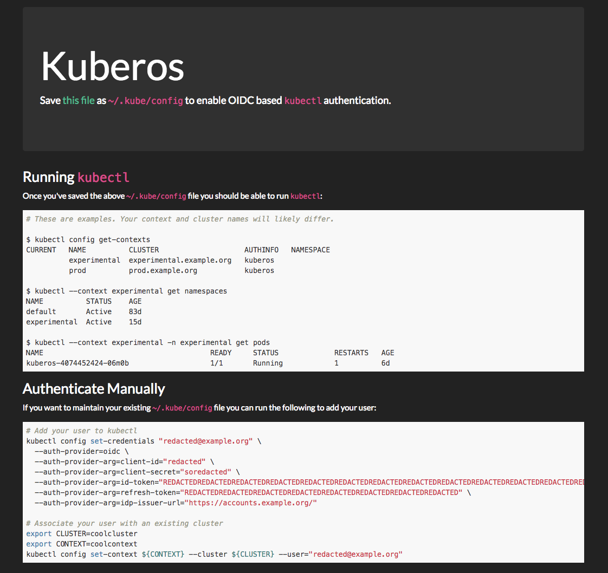

# kuberos [](https://hub.docker.com/r/negz/kuberos/) [](https://godoc.org/github.com/negz/kuberos) [](https://travis-ci.org/negz/kuberos/) [](https://codecov.io/gh/negz/kuberos/)
An OIDC authentication helper for Kubernetes' `kubectl`.



## Purpose
Kubernetes supports several authentication methods, a popular one of which is OIDC.
The `kubectl` commandline tool can be configured to use OIDC authentication, including
automatically refreshing its token on invocation. In order to enable this
functionality `kubectl` must be configured with the following parameters:
* A client ID
* A client secret
* An issuer URL
* An ID token
* A refresh token

The latter two of these parameters must be aquired by performing an initial OIDC
authentication outside of `kubectl`. OIDC is an awkward authentication method for a
commandline tool as it is entirely browser based. Existing implementations (see
Alternatives) provide CLI tools to handle this initial authentication. These CLIs will
typically require the user connect to localhost in their Browser to perform the initial
authentication.

Kuberos is designed to instead run as a hosted service. It authenticates users against
an OIDC provider, returning a JSON payload of the parameters required by
`kubectl`. Kuberos provides a simple frontend that links to a `~/.kube/config` file
generated from a supplied template of clusters. It also details how to manually add a
user and context to a cluster, and how to use kubectl.

## Usage
Kuberos is [published](https://hub.docker.com/r/negz/kuberos) to the Docker Hub.
It must be configured with an OIDC issuer, client ID, and secret, as well as a
partial `kubeconfig` file.

```bash
$ docker run negz/kuberos:latest /kuberos --help
usage: kuberos [<flags>] [<oidc-issuer-url>] [<client-id>] [<client-secret-file>] [<kubecfg-template>]

Provides OIDC authentication configuration for kubectl.

Flags:
      --help             Show context-sensitive help (also try --help-long and
                         --help-man).
      --listen=":10003"  Address at which to expose HTTP webhook.
  -d, --debug            Run with debug logging.
      --shutdown-grace-period=1m
                         Wait this long for sessions to end before shutting
                         down.

Args:
  [<oidc-issuer-url>]     OpenID Connect issuer URL.
  [<client-id>]           OAuth2 client ID.
  [<client-secret-file>]  File containing OAuth2 client secret.
  [<kubecfg-template>]    A kubecfg file containing clusters to populate with a
                          user and contexts.
```

The partial `kubeconfig` template should contain only cluster entries. For
example:

```yaml
apiVersion: v1
kind: Config
clusters:
- name: production
  cluster:
    certificate-authority-data: REDACTED
    server: https://prod.example.org
- name: staging
  cluster:
    certificate-authority-data: REDACTED
    server: https://staging.example.org
```

Given the above template Kuberos will generate a `kubeconfig` file containing
the two supplied clusters, the authenticated OIDC user, and a context for each
cluster associating them with the OIDC user. These contexts inherit the name of
the clusters, thus a user could interact with the production cluster by running:
```bash
kubectl --context production cluster-info
```

## Alternatives
* https://github.com/micahhausler/k8s-oidc-helper
* https://github.com/coreos/dex/tree/master/cmd/example-app
